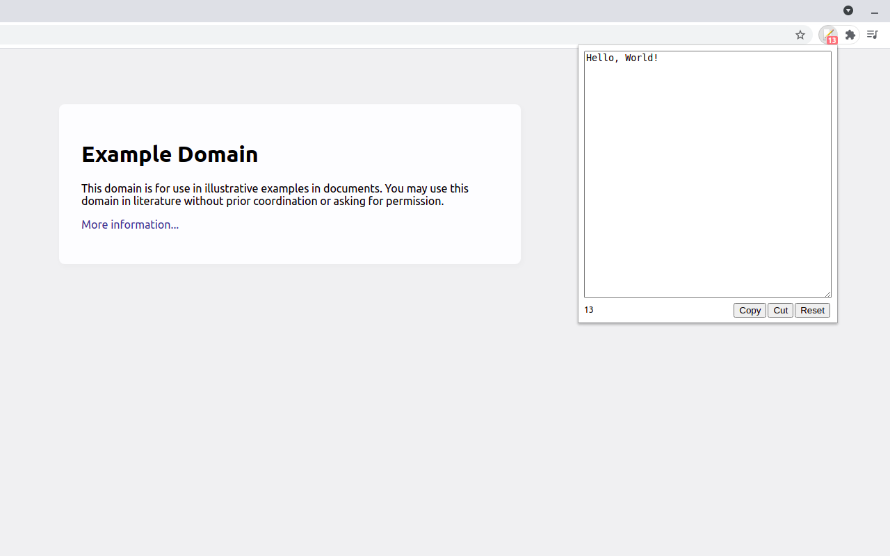
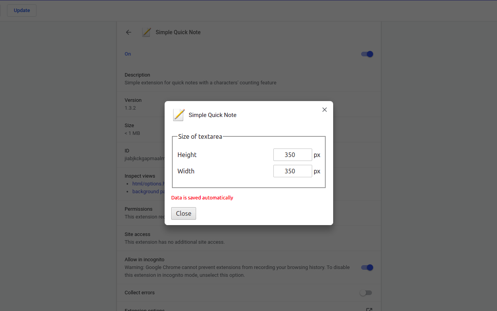

# [Simple Quick Note](https://chrome.google.com/webstore/detail/jiabjkckgapmaalmfbjdkcbkpiafnfga)

- [Installation for developers (for Linux users)](#installation-for-developers-for-linux-users)
- [Sources](#sources)

Chrome extension for quick notes with a characters' counting feature.

## Installation for developers (for Linux users)

1. Go to the `chrome://extensions`.
2. Enable `Developer mode` checkbox.
3. Click on the `Load unpacked` button.
4. Select the extension directory.

## Sources

- icon: http://iconarchive.com/show/crystal-clear-icons-by-everaldo/Action-edit-icon.html
